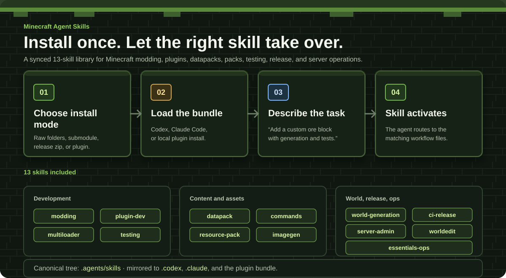

# Minecraft Agent Skills

Thirteen reusable skills for Minecraft 1.21.x development and operations, plus
a Forge 1.20.1 lane for legacy modding. Use raw skills in a project or install
the bundled Codex and Claude Code plugin.

## Install

Copy the surface your agent host uses. Preserve unrelated local skills when a
target already exists.

| Host | Copy or install |
| --- | --- |
| Codex | `.agents/` |
| Codex compatibility | `.codex/` |
| Claude Code | `.claude/` |
| Plugin | `.agents/plugins/marketplace.json` and `plugins/minecraft-codex-skills/` |

For a Codex plugin install, keep the marketplace file and plugin directory under
the same project root, open the plugins surface, and install
`minecraft-codex-skills`. For Claude Code, run:

```bash
claude --plugin-dir ./plugins/minecraft-codex-skills
```

`minecraft-imagegen` needs a host with image-generation support. Codex provides
that support directly.

<!-- markdownlint-disable MD033 -->
<p align="center">
  
</p>
<!-- markdownlint-enable MD033 -->

## Skills

| Skill | Use it for |
| --- | --- |
| `minecraft-modding` | NeoForge, Fabric, and Forge 1.20.1 mods |
| `minecraft-plugin-dev` | Paper, Bukkit, and Spigot plugins |
| `minecraft-datapack` | Vanilla datapacks, functions, loot, and advancements |
| `minecraft-commands-scripting` | Commands, scoreboards, NBT, and RCON scripting |
| `minecraft-multiloader` | Architectury projects targeting NeoForge and Fabric |
| `minecraft-testing` | JUnit, MockBukkit, and GameTests |
| `minecraft-ci-release` | GitHub Actions and Modrinth/CurseForge releases |
| `minecraft-world-generation` | Biomes, dimensions, structures, and features |
| `minecraft-resource-pack` | Textures, models, sounds, fonts, and shaders |
| `minecraft-imagegen` | Pack art, concepts, thumbnails, and UI mockups |
| `minecraft-server-admin` | Hosting, tuning, backups, proxies, and operations |
| `minecraft-worldedit-ops` | Safe WorldEdit selections, schematics, and brushes |
| `minecraft-essentials-ops` | EssentialsX configuration, moderation, and economy |

## Maintaining the bundle

Edit `.agents/skills/`, then run:

```bash
npm run sync:skills
npm run check
```

The sync command refreshes `.codex/skills/`, `.claude/skills/`, and the plugin
bundle. The copied skill directories do not need the repository's Node tooling.

## License

[MIT](LICENSE)
